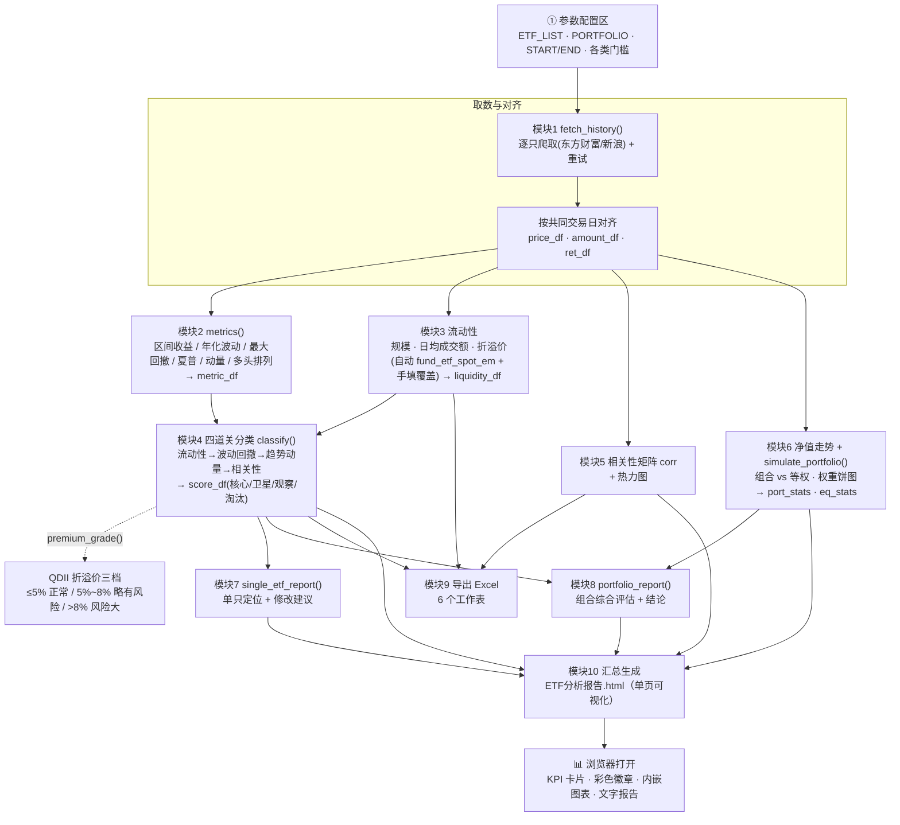

# ETF 组合分析与评估工具 · 使用说明与注意事项

配套文件：`ETF组合分析与评估.ipynb`（主程序）、`ETF分析报告.html`（运行后自动生成的可视化单页报告）、`ETF分析结果.xlsx`（运行后自动生成的导出结果）。

---

## 一、操作方法

### 1. 环境准备（首次）
本工具所需依赖已安装：
`akshare、pandas、numpy、matplotlib、nbformat、nbconvert、ipykernel、ipywidgets`。
如换机器，命令行执行一次即可：

```
pip install -r requirements.txt
```

或手动安装：

```
pip install akshare pandas numpy matplotlib nbformat nbconvert ipykernel ipywidgets
```

### 2. 运行步骤
1. 用 Jupyter / VS Code 打开 `ETF组合分析与评估.ipynb`。
2. **只改第一个「参数配置区」单元格**（见下表）。
3. 顶部菜单 `Kernel → Restart & Run All`，从上到下依次出表格、图、两份报告。
4. 末尾自动导出 `ETF分析结果.xlsx`（6 个工作表）。
5. 最后一格自动汇总全部结果，生成 `ETF分析报告.html`——一个样式美观、可直接用浏览器打开的单页可视化报告（KPI 卡片、彩色徽章分类、内嵌图表、热力相关性矩阵、两份文字报告，自包含无需联网）。

### 3. 配置区参数一览（只需改这一个单元格）

| 参数 | 作用 | 示例 / 默认 |
|---|---|---|
| `DATA_SOURCE` | 数据源切换，一个字 | `'sina'`(新浪,稳) / `'eastmoney'`(东方财富,前复权) |
| `ETF_LIST` | 待分析 ETF，`{名称: 6位代码}`，**不用**加 sh/sz | `{'沪深300ETF华泰柏瑞':'510300', ...}` |
| `PORTFOLIO` | 组合权重（名称须与 `ETF_LIST` 一致，自动归一化） | `{'沪深300...':0.25, ...}` |
| `START` / `END` | 时间范围 `YYYYMMDD` | `'20260101'` / `'20260606'` |
| `FOCUS_ETF` | 重点出"定位+修改建议"的那只；`None` 则逐只输出 | `'科创芯片ETF嘉实'` |
| `TRADING_DAYS` | 年化用交易日数 | `252` |
| `RF_ANNUAL` | 无风险年化收益 | `0.018`（不考虑设 `0.0`） |
| `SCALE_MIN_YI` | 规模门槛（亿），低于淘汰 | `10` |
| `TURNOVER_MIN_WAN` | 日均成交额门槛（万），低于淘汰 | `2000` |
| `PREMIUM_CAP_PCT` | **普通** ETF 折溢价上限（%），超过淘汰 | `1.0` |
| `QDII_PREMIUM_GOOD` | QDII/跨境折溢价「正常」上限（%） | `5.0` |
| `QDII_PREMIUM_WARN` | QDII/跨境折溢价「略有风险」上限（%），超过即「风险大」淘汰 | `8.0` |
| `QDII_ETF` | 手动指定哪些算跨境（按名称） | `set()`，如 `{'某ETF'}` |
| `QDII_KEYWORDS` | 名称含这些关键字自动按 QDII 识别 | 纳指/标普/道琼斯/恒生/港股/美国/原油… |
| `CORE_VOL_CAP` | 核心-年化波动率上限 | `0.20` |
| `CORE_MDD_CAP` | 核心-最大回撤上限（负数） | `-0.10` |
| `CORR_HIGH` | 相关性"过高/重叠"阈值 | `0.80` |
| `AUTO_LIQUIDITY` | 是否自动取流动性 | `True` |
| `MANUAL_LIQUIDITY` | 手填/覆盖流动性 | `{'某ETF':{'规模亿':50,'日均成交额万':8000,'折溢价':0.1}}` |
| `OUTPUT_XLSX` | Excel 导出文件名 | `'ETF分析结果.xlsx'` |
| `OUTPUT_HTML` | 可视化 HTML 报告文件名 | `'ETF分析报告.html'` |

### 4. 分类方法论（建候选池 → 过四道关 → 核心/卫星）
- **关卡1 流动性**：规模≥10亿、日均成交额≥2000万、|折溢价|≤1%；
  - **QDII/跨境折溢价三档**：`≤5% 正常`（放行）、`5%~8% 略有风险`（仍放行但提示）、`>8% 风险大`（淘汰）。
  - 任一硬门槛不达标 → **淘汰**。
- **关卡2 波动与回撤**：年化波动率 < 20% 且 最大回撤 > −10% → 可作 **核心**（求稳，约 70–80% 仓位）。
- **关卡3 趋势与动量**：均线多头排列（MA5>MA10>MA20）或近20日动量为正，且区间收益为正 → 可作 **卫星**（求收益，约 20–30% 仓位）；否则 **观察**。
- **关卡4 相关性**：核心与卫星、卫星之间尽量低相关，以压低组合回撤、抬高组合夏普。

---

## 二、注意事项

1. **指标都是"向后看"的**——衡量过去表现，不能预测未来。用于客观横向排序、搭稳健结构，实盘仍需结合趋势、估值、事件风险与个人风险偏好。
2. **两个数据源的区别**：东方财富是**前复权**(qfq)更严谨但偶发连接中断；新浪是**不复权**、连接更稳。窗口内若有除息，新浪算出的回撤会略偏大。默认用新浪。
3. **流动性自动获取依赖 `ipywidgets`**：`fund_etf_spot_em` 在 Jupyter 里用 tqdm 进度条，缺 ipywidgets 会报 `IProgress not found`，导致规模/折溢价取不到。
4. **取不到流动性不会误杀**：规模/折溢价缺失时标"流动性待补充"并照常按波动/回撤分类，只有**已知数值真正越线**才判"淘汰"。可用 `MANUAL_LIQUIDITY` 补。
5. **QDII/跨境折溢价偏大属正常**：海外市场休市时 IOPV 估值滞后，折溢价天然偏大。已按三档处理；若仍想放宽，调高 `QDII_PREMIUM_WARN`（如 `10.0`）即可。名称未被关键字识别到的跨境品种，手动加进 `QDII_ETF`。
6. **代码前缀自动处理**：5/6 开头→sh，1 开头→sz，只填 6 位数字即可。
7. **数据量要够**：均线多头排列需 ≥20 个交易日；想看 MA 趋势建议窗口拉到 3 个月以上。
8. **`ETF分析结果.xlsx` 每次重跑会覆盖**，是样例输出而非存档，需要留存请改名或另存。
9. **权重会自动归一化**：`PORTFOLIO` 加总不必等于 1。

---

## 三、已实现的功能

| 需求 | 实现位置 | 说明 |
|---|---|---|
| 双数据源、参数切换 | 配置 + 模块1 | `fetch_history()` 兼容东方财富/新浪 |
| 按代码+时间自动爬取 | 模块1 | 逐只抓取，按共同交易日对齐（带重试） |
| 夏普比率 | 模块2 | (年化收益−无风险)/年化波动 |
| 最大回撤 | 模块2 | 相对历史高点最大跌幅 |
| 区间收益率 | 模块2 | 末值/首值−1 |
| 年化波动率 | 模块2 | 日收益标准差 × √252 |
| 相关性矩阵 | 模块5 | `ret_df.corr()` + 热力图 |
| 流动性处理（可爬可手填） | 模块3 | 规模(总市值/1e8)、折溢价(基金折价率)，日均成交额由窗口算 |
| 单只 ETF 定位+修改建议 | 模块7 | 按角色/波动/动量/相关性/夏普/折溢价档逐条建议 |
| 组合综合评估报告+结论 | 模块8 | 绩效、核心/卫星仓位结构、分散度、集中度、风格定位、改进建议 |

**额外增强**：四道关分类（核心/卫星/观察/淘汰）、QDII 折溢价三档评级、近20日动量+均线多头排列、可视化（相关性热力图/归一化净值/组合净值 vs 等权/权重饼图）、组合 vs 等权对比、Excel 6-sheet 导出、**一键生成样式美观的单页可视化 HTML 报告**（自包含、彩色徽章分类、内嵌图表、热力相关性矩阵）。

---

## 四、代码结构与流程

### 1. 整体数据流程图



### 2. Notebook 单元格对照

| 模块 | 主要函数 / 产物 | 作用 |
|---|---|---|
| 配置区 | `ETF_LIST`/`PORTFOLIO`/门槛参数 | 唯一需要手改的单元格 |
| 模块1 | `fetch_history()` → `price_df`/`amount_df`/`ret_df` | 爬取并按交易日对齐 |
| 模块2 | `metrics()`/`max_drawdown()`/`ma_bull()` → `metric_df` | 绩效与动量指标 |
| 模块3 | 自动/手填流动性 → `liquidity_df` | 规模/成交额/折溢价 |
| 模块4 | `classify()`/`premium_grade()` → `score_df` | 四道关分类 + QDII 三档 |
| 模块5 | `ret_df.corr()` → `corr` | 相关性矩阵 + 热力图 |
| 模块6 | `simulate_portfolio()` → `port_stats`/`eq_stats` | 净值走势 + 组合模拟 |
| 模块7 | `single_etf_report()` | 单只 ETF 定位与建议 |
| 模块8 | `portfolio_report()` | 组合综合评估报告 |
| 模块9 | `pd.ExcelWriter` → `ETF分析结果.xlsx` | 6-sheet 导出 |
| 模块10 | `_b64()`/`CHARTS` → `ETF分析报告.html` | 汇总全部结果的单页报告 |

> 关键数据对象（贯穿全流程）：`price_df`（对齐收盘价）、`ret_df`（日收益）、`metric_df`（指标）、`liquidity_df`（流动性）、`score_df`（分类结论）、`corr`（相关性）、`port_stats`/`eq_stats`（组合绩效）、`CHARTS`（base64 图表）。

---

> 免责声明：本工具及其输出均为基于历史数据的客观测算，不构成任何投资建议。投资有风险，入市需谨慎。
